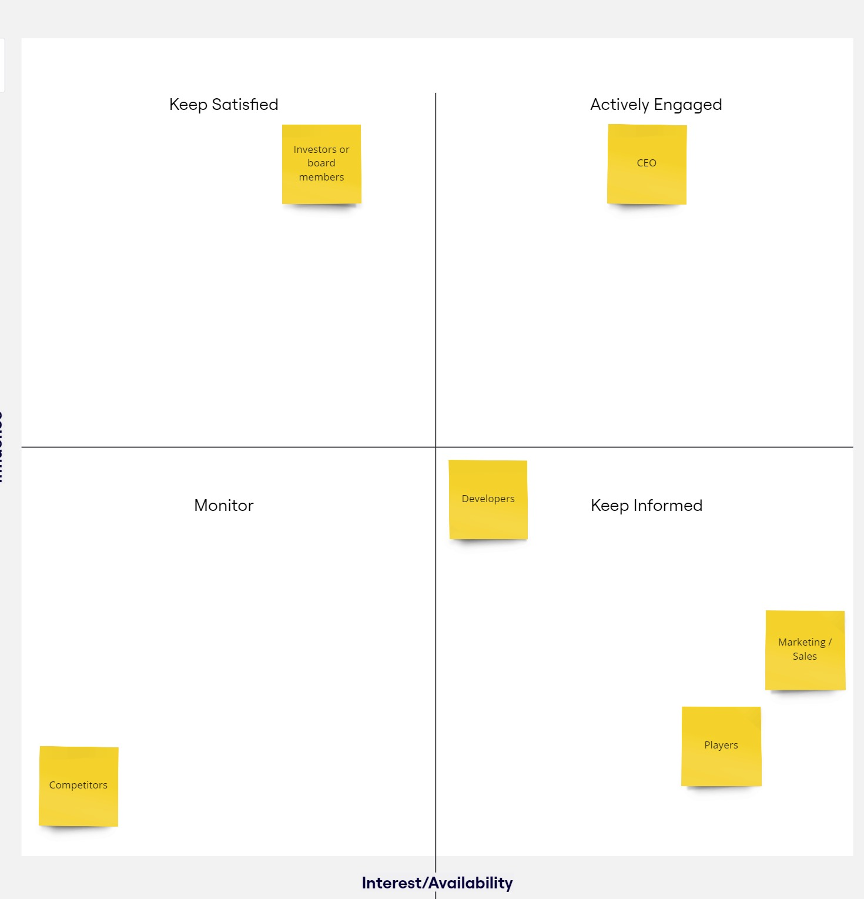
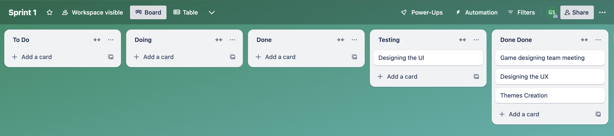
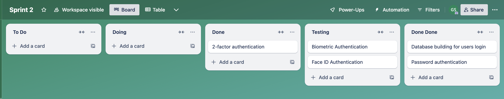
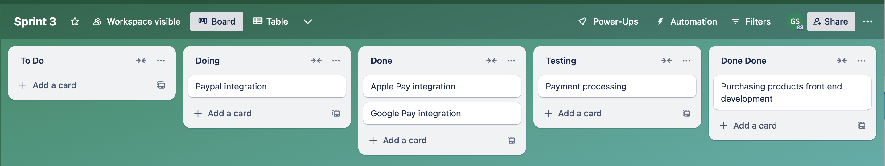
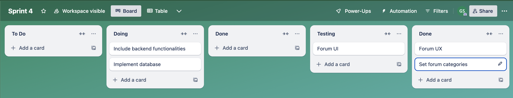
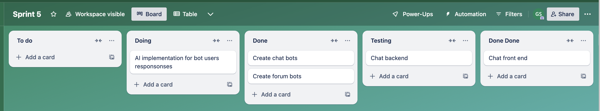
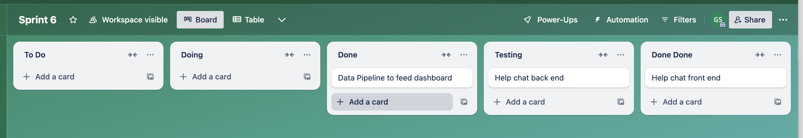

# Change Task - MA GS

## Exec summary

## Proposed solutions

For 3. Is building a solution best method. 3rd party options very good (would they work out cheaper). Provide training for staff on this. Looks like a separate project. Build data of improvements from using 3rd party tools to form a picture of how changes have been successful.

1, 2 and 4. Develop an app with:

- Micro transactions and DLC for main games.
- Could add mini-games into app with paid for content (paid games, free to play for first levels, ads)
- Store front for above + payment processing
- Forum in app for players, used to monitor players attitudes to game, official feedback channels in forum.
- Surveys or forum posts (e.g. bots asking for experience of game) automated pipeline for gathering feedback from app.
- Gather user data of using app and analyse impact of these.

## Stakeholder Analysis

Who are the stakeholders:

1. Players of the game

2. Developers

3. Marketing/sales team

4. Investors

5. CEO

6. Competitors (secondary)

Summary of needs

## Wireframe (last)

## Agile plan

### Project plan

Apps purpose is to provide a place for revenue generating mini games (later stage), a place for purchasing DLCs for main game. A forum and social place for players of the game to interact and talk, with this being extended for a feedback on the game direct to developers.

### User Stories

Players of the game: ""

Developers: ""

Marketing/sales team: ""

Investors: ""

CEO: ""

### Sprint plans

Sprint 1:
Designing of app with UI, UX, themes, feel to fit in with game.

Sprint 2:
Authentication and user login with database for storing info

Sprint 3:
Payment processing and frontend for buying products

Sprint 4:
Forum implementation with front and back end

Sprint 5:
Front and backend of chat/forum bots to interact with users.

Sprint 6:
Help chat using main of what is built in sprint 5 to allow help to players
With pipeline of data to feed dashboard.

Sprint 7:
DLC content for main games
Mini games for app
Add in ads to app in relevant sections

## Backlog

1. Designing of the UX
2. Designing of the UI (meet with the game design team)
3. Authentication
4. Database building for users login
5. Payments processing
6. Forum frontend
7. Database building for forum
8. Chat bots for gathering data
9. Frontend of chat
10. Backend of chatting with help
11. Data pipeline to form dashboard for developers
12. Develop DLC content for main games for sale
13. Design mini game
14. Code and add mini games in app
15. Ads in game

### Trello Boards

#### Sprint 1

#### Sprint 2

#### Sprint 3

#### Sprint 4

#### Sprint 5

#### Sprint 6

#### Sprint 7

